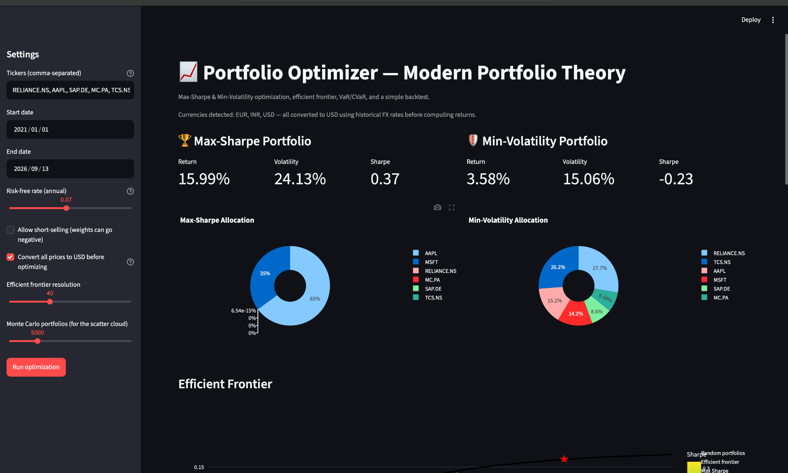
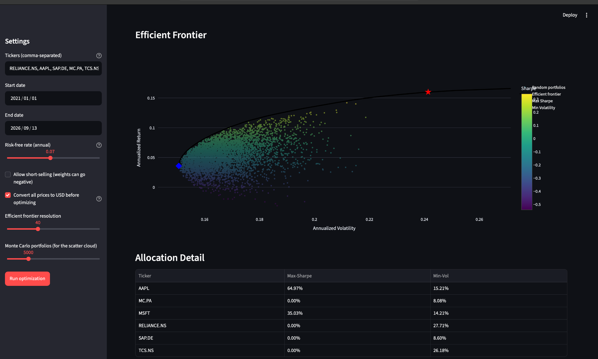
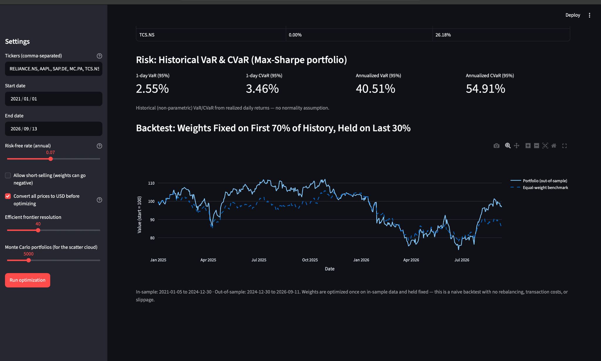

# Portfolio Optimizer (Modern Portfolio Theory)

A Python tool that builds Max-Sharpe and Minimum-Volatility portfolios from
real market data across **multiple global markets** (India, US, Germany,
France), traces the efficient frontier, handles the currency conversion
that mixing those markets requires, and reports basic risk metrics
(VaR/CVaR) — with an interactive Streamlit dashboard on top.

New to the finance/stats terms used below (Sharpe ratio, efficient frontier,
VaR, etc.)? See **[GLOSSARY.md](GLOSSARY.md)** for a plain-language explanation
of every one.

## Project structure

```
├── optimizer.py       # Pure math engine (MPT, SLSQP, Monte Carlo, VaR/CVaR) — no network calls
├── data_loader.py     # Fetches, cleans, and currency-converts price data via yfinance
├── app.py             # Streamlit dashboard tying the two together
├── requirements.txt
├── GLOSSARY.md        # Plain-language explanation of every term used
├── LICENSE
└── README.md
```

`optimizer.py` has zero dependency on `data_loader.py`, so the math can be
tested offline with synthetic data (run `python optimizer.py` — it already
does this as a self-check).

## Setup

```bash
python -m venv venv
source venv/bin/activate        # Windows: venv\Scripts\activate
pip install -r requirements.txt
```

## Running it

**CLI sanity check (no data download, pure math):**
```bash
python optimizer.py
```

**Fetch data and print stats for a fixed ticker list:**
```bash
python data_loader.py
```

**Full interactive dashboard:**
```bash
streamlit run app.py
```
Then enter tickers in the sidebar — mix markets freely, e.g.
`RELIANCE.NS, AAPL, SAP.DE, MC.PA, TCS.NS, MSFT`.

| Market | Suffix | Example |
|---|---|---|
| India (NSE) | `.NS` | `RELIANCE.NS`, `TCS.NS`, `HDFCBANK.NS` |
| Germany (DAX 40) | `.DE` | `SAP.DE`, `SIE.DE`, `ALV.DE` |
| France (CAC 40) | `.PA` | `MC.PA` (LVMH), `OR.PA` (L'Oréal), `TTE.PA` |
| US | none | `AAPL`, `MSFT`, `GOOGL` |

Prices come back in each exchange's local currency (₹ / € / $). The app
detects this and converts everything to USD using historical FX rates
before computing returns or optimizing — otherwise a stock could look
like it "grew" purely because its currency strengthened. See
`convert_to_common_currency()` in `data_loader.py`, and the FX section of
GLOSSARY.md.

## What's implemented

- **Expected return, variance, Sharpe ratio** — the standard MPT formulas
- **Max-Sharpe** and **Min-Volatility** portfolios via `scipy.optimize.minimize`
  (SLSQP), long-only by default with an optional short-selling toggle
- **Efficient frontier**: swept by solving min-vol at a grid of target returns
- **Monte Carlo cloud**: random long-only portfolios plotted for visual
  cross-check against the analytical frontier
- **Historical VaR & CVaR** at the 95% confidence level (non-parametric —
  no normal-distribution assumption)
- **Naive backtest**: weights fit on the first 70% of history, held fixed,
  evaluated out-of-sample against an equal-weight benchmark

## Known limitations (worth stating in a writeup, not hiding)

- Expected returns are estimated from **historical means**, which are
  notoriously noisy forward-looking estimates — this is one of the major
  weaknesses of textbook MPT, not a bug in this code
- The backtest has **no rebalancing, transaction costs, or slippage** —
  it is a lower bound on real-world friction, not a performance claim
- VaR/CVaR are **historical, non-parametric estimates** based on the available
  historical return data, so they describe past tail losses rather than
  providing a guaranteed future loss bound
  
## Roadmap for extending this (in rough order of effort)

1. **Rolling-window backtest** — instead of one train/test split, re-optimize
   weights every N days on a trailing window and chain the results together
   (a real walk-forward backtest instead of the current single-split version)
2. **Market benchmark comparison** — add Nifty 50 or S&P 500 as a market
   benchmark and report tracking error / information ratio alongside Sharpe
3. **Black-Litterman model** — blend market-implied equilibrium returns with
   your own views, rather than relying purely on historical means (addresses
   the biggest limitation above)
4. **Hierarchical Risk Parity (HRP)** — a robustness alternative to
   mean-variance optimization that can be more stable when many assets are
   highly correlated
5. **Factor exposure** — regress portfolio returns on Fama-French factors
   or a simple momentum/value/size split to understand the portfolio's
   underlying sources of return and risk
   
## Project context

This project was developed as an independent finance and quantitative
analysis portfolio project to apply Modern Portfolio Theory to real-world
multi-market financial data.

The implementation combines portfolio optimization, statistical risk
analysis, currency conversion, visualization, and out-of-sample evaluation
in an interactive Streamlit application.
## Screenshots

### Portfolio Optimization Dashboard


### Efficient Frontier & Portfolio Allocation


### Risk Analysis & Backtesting

